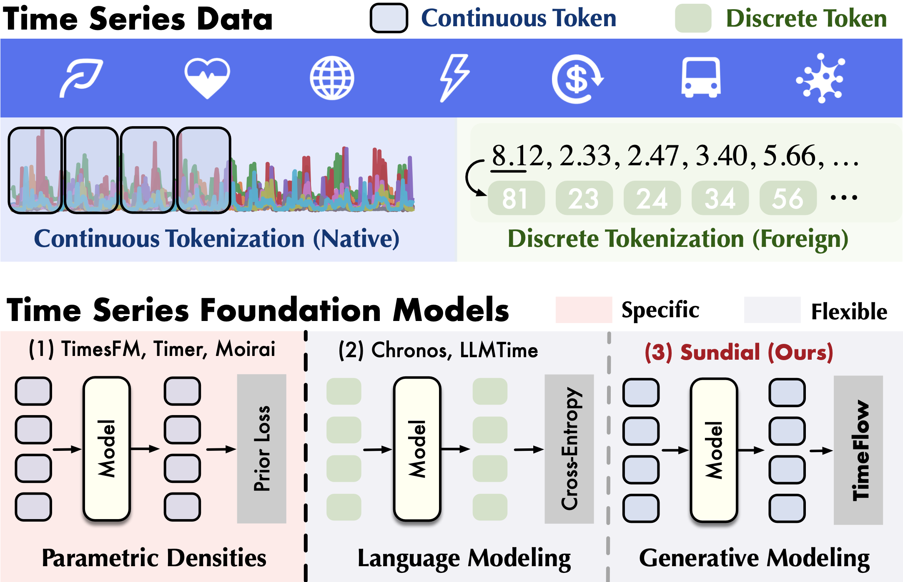

# Sundial for CTF4Science

This directory contains the evaluation code for the Sundial foundation model within the CTF4Science framework.

## Introduction

Sundial is a family of **generative** time series foundation models, which is pre-trained on TimeBench (**10^12** time points). The model can be applied for both **point** / **probabilistic** **zero-shot** forecasting.

Not only the mean or quantiles, you can estimate anything about the predictive distribution with raw generated samples.

We propose **TimeFlow Loss** to predict next-patch’s distribution, allowing Transformers to be trained **without discrete tokenization** and make **non-deterministic predictions**.

<p align="center">

</p>

Reference Article:


```bibtex
@article{liu2025sundial,
  title={Sundial: A Family of Highly Capable Time Series Foundation Models},
  author={Liu, Yong and Qin, Guo and Shi, Zhiyuan and Chen, Zhi and Yang, Caiyin and Huang, Xiangdong and Wang, Jianmin and Long, Mingsheng},
  journal={arXiv preprint arXiv:2502.00816},
  year={2025}
}
```

## Setup

To run the model, make sure to install the required dependencies. You can do this by running:

```bash
pip install -r requirements.txt
```

Then install the ctf4science package from the git repository.

## How to Run

Running the .py file:

```bash
python run.py config_Lorenz.yaml
```

Example of config file:

```yaml

dataset:
  name: PDE_KS
  pair_id:
  - 1
  - 2
  - 3
  - 4
  - 5
  - 6
  - 7
  - 8
  - 9
model:
  name: sundial
  num_samples: 5
  spatial_batch: 10

```
